# FitnestX fitnes uygulaması
Bu proje FitnestX UI kitinin mobile uygulamaya dökülmüş halidir, 
> ⚠️ **Uyarı: BU UYGULAMA HALA GELİŞTİRME AŞAMASINDADIR**
## Kullanılan Paketler

| Paketler | Versionlar |
|---|---|
| equatable | ^2.0.5|
| flutter_bloc | ^8.1.6|
| firebase_core  | ^3.5.0 |
| firebase_auth  | ^5.3.0|
| flutter_facebook_auth | ^7.1.1 |
| google_sign_in | ^6.2.1|
| cloud_firestore| ^5.4.4|
| fl_chart |^0.69.0|

<table>
  <tr>
    <td style="border: none;">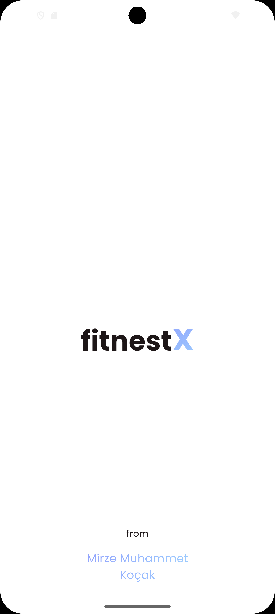</td>
    <td style="border: none;">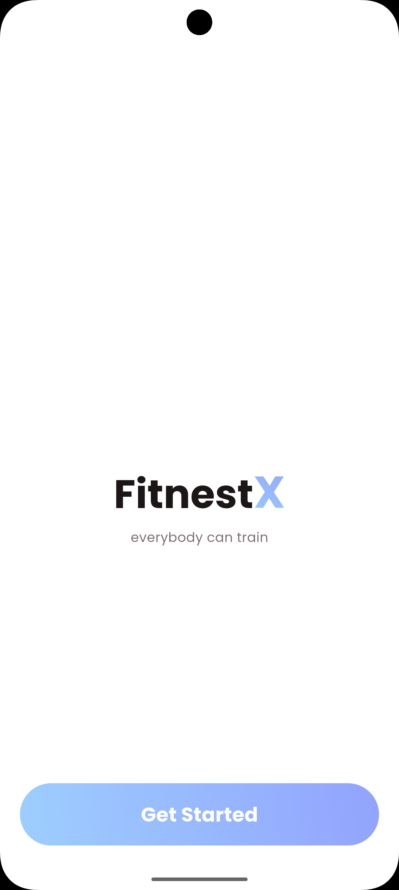</td>
  </tr>
  <tr>
    <td style="border: none;">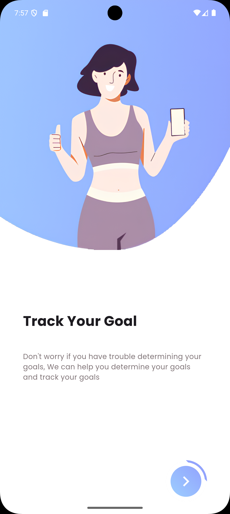</td>
    <td style="border: none;">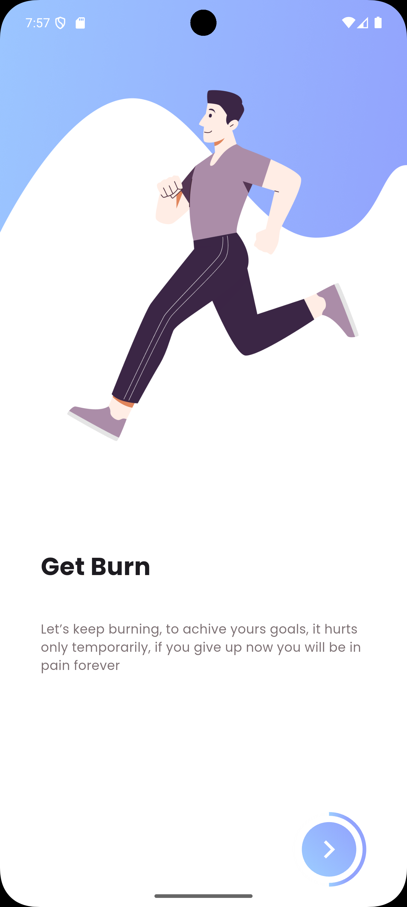</td>
  </tr>
  <tr>
    <td style="border: none;">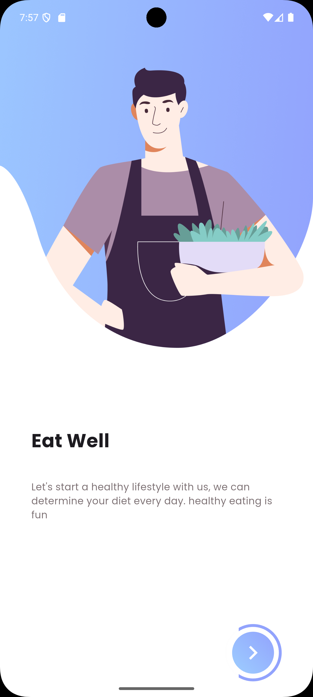</td>
    <td style="border: none;">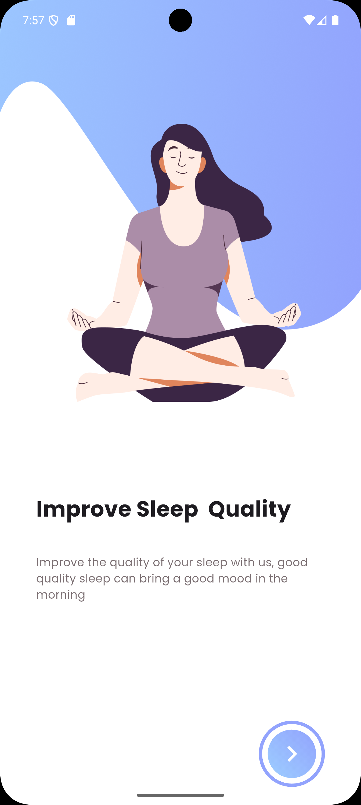</td>
  </tr>
  <tr>
    <td style="border: none;">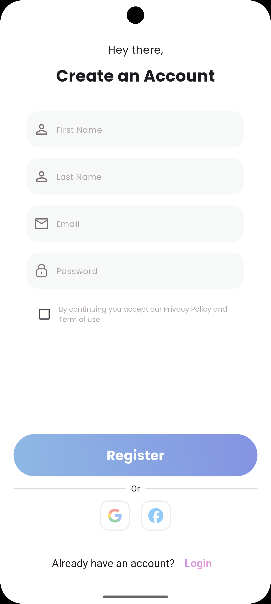</td>
    <td style="border: none;">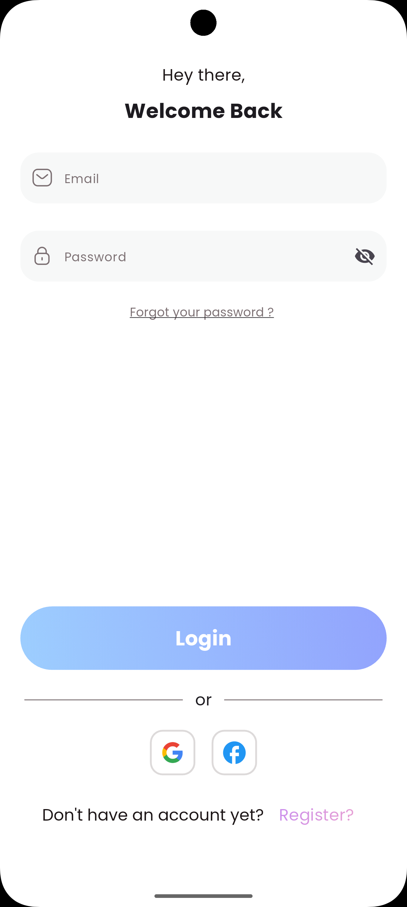</td>
  </tr>
  <tr>
    <td style="border: none;">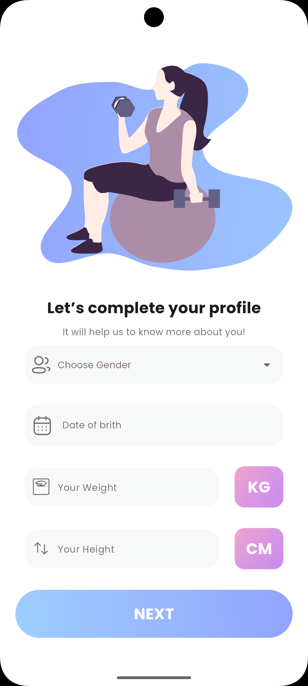</td>
    <td style="border: none;">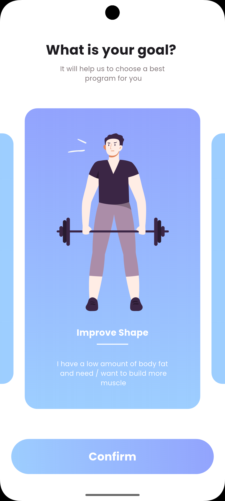</td>
  </tr>
  <tr>
    <td style="border: none;">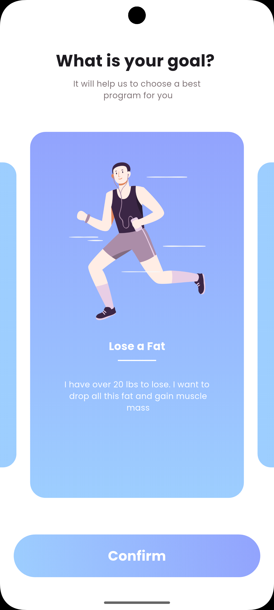</td>
    <td style="border: none;">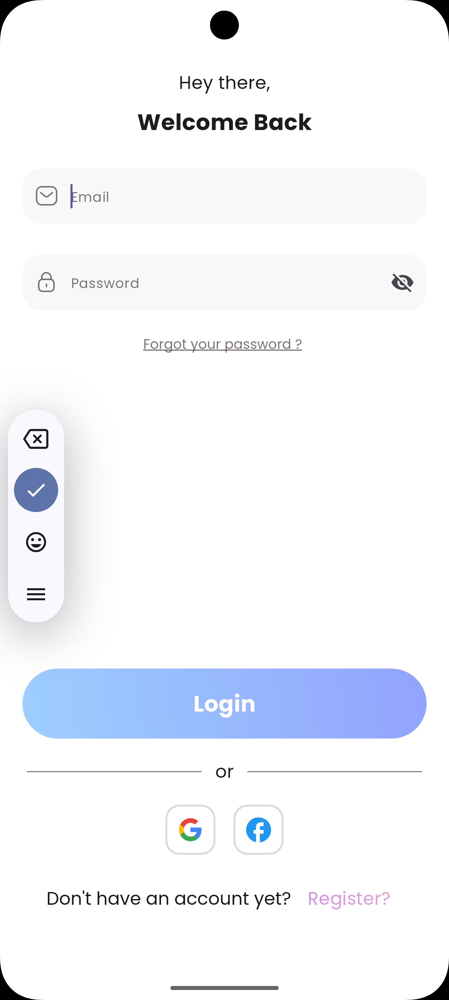</td>
  </tr>
  <tr>
    <td style="border: none;">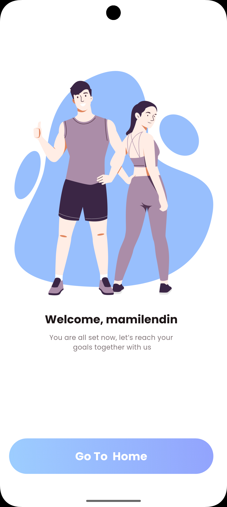</td>
    <td style="border: none;">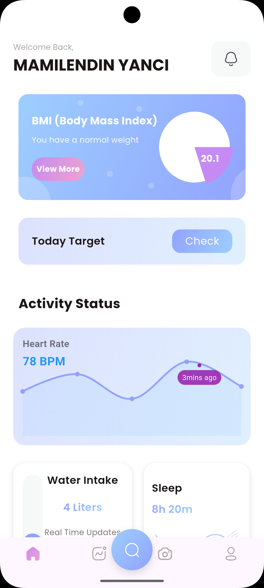</td>
  </tr>
  <tr>
    <td style="border: none;">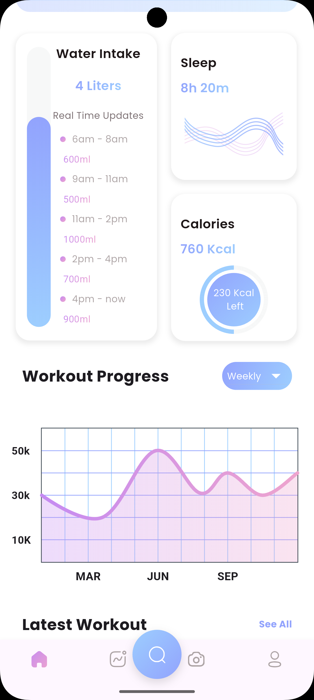</td>
    <td style="border: none;">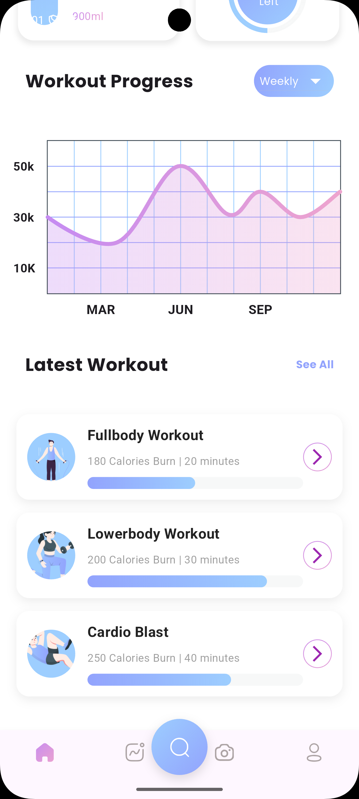</td>
  </tr>
  <tr>
    <td style="border: none;">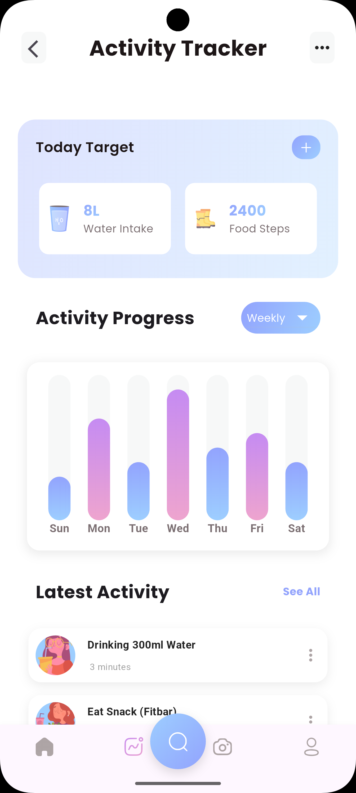</td>
    <td style="border: none;">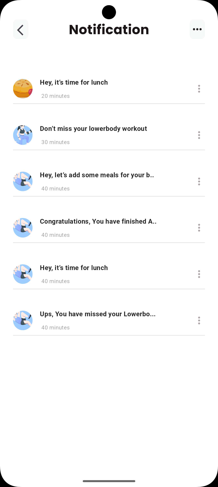</td>
  </tr>
  <tr>
    <td style="border: none;">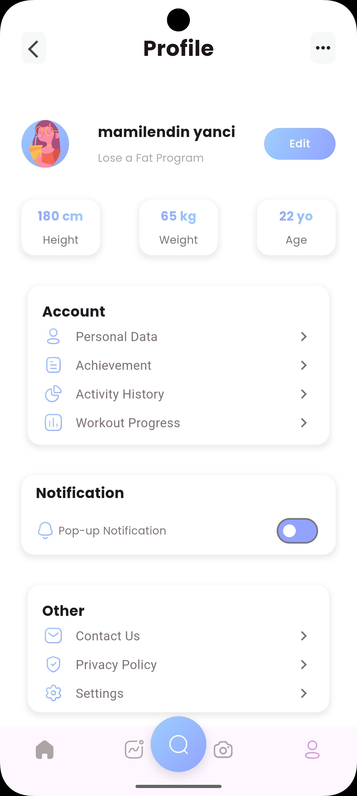</td>
  </tr>
</table>
